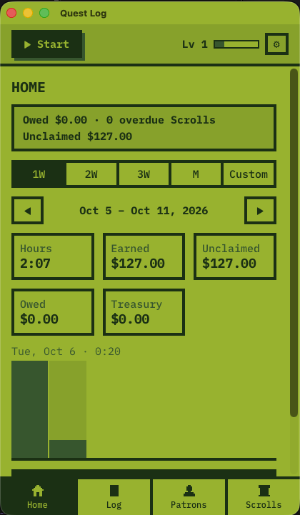

# Quest Log

A pixel-art RPG time tracker and invoicer for one freelancer: log hours, run a menu-bar Timer, send invoices, level up. Local, private, no account.



**Apple silicon (arm64) only, macOS 11 or later.**

## Install

Quest Log isn't notarized (no paid Apple Developer account), so macOS blocks it the first time. You approve it once.

1. Download `Quest.Log_<version>_aarch64.dmg` from [Releases](https://github.com/edscaylart/quest-log/releases/latest).
2. Open the DMG and drag **Quest Log** to **Applications**.
3. Open Quest Log from Applications. macOS says it can't be opened; click **Done**.
4. Open **System Settings › Privacy & Security**, scroll to **Security**, click **Open Anyway** next to Quest Log, and enter your password. (The button shows for about an hour after step 3.)

Control-click → Open no longer works on macOS 15 and later.

Prefer the terminal? Skip steps 3–4 and remove the quarantine flag instead:

```sh
xattr -dr com.apple.quarantine "/Applications/Quest Log.app"
```

## Updates

Quest Log checks for a new release each time it starts and offers **Install & Restart**. Updates are verified with the app's own signature and don't need Open Anyway again.

Move the app to **/Applications** first. Run from the DMG or Downloads, macOS launches it from a read-only copy and updates fail.

## Build from source

A build made on your own Mac isn't quarantined, so Gatekeeper never asks.

You need [Rust](https://rustup.rs), [Node.js](https://nodejs.org) 24 with [pnpm](https://pnpm.io), and the Xcode Command Line Tools (`xcode-select --install`).

```sh
git clone https://github.com/edscaylart/quest-log.git
cd quest-log
pnpm install
pnpm tauri build
```

The app lands in `src-tauri/target/release/bundle/macos/Quest Log.app`. `pnpm tauri dev` runs it with live reload.

Working on the code? Start at [ARCHITECTURE.md](docs/ARCHITECTURE.md): the app map, the folder rules and the full doc index. Commands and toolchain are in [ENV.md](docs/ENV.md), tests in [TESTING.md](docs/TESTING.md).

## Your data

Everything lives in one SQLite file on your Mac, never in the cloud:

```
~/Library/Application Support/io.github.edscaylart.questlog/quest-log.db
```

**Settings › Data** shows the path and has **Reveal in Finder**.

- **Backups**: a snapshot goes in the `backups/` folder beside the database on the first launch of each day (last 7 kept) and before every schema migration (last 3 kept). **Back up now** saves a copy wherever you choose.
- **Restore**: **Restore from backup…** replaces all data with a backup, after backing up your current data first, then restarts.
- **CSV**: **Export CSV…** exports time entries for a period, optionally for one client (Patron).

## License

[MIT](LICENSE). The bundled IBM Plex Mono font is under the [SIL Open Font License](src/styles/fonts/OFL.txt).

Personal project. Open an issue before a PR.

## Pointers

- [docs/ARCHITECTURE.md](docs/ARCHITECTURE.md)
- [docs/CONTEXT.md](docs/CONTEXT.md)
- [docs/ENV.md](docs/ENV.md)
- [docs/TESTING.md](docs/TESTING.md)
- [AGENTS.md](AGENTS.md)
